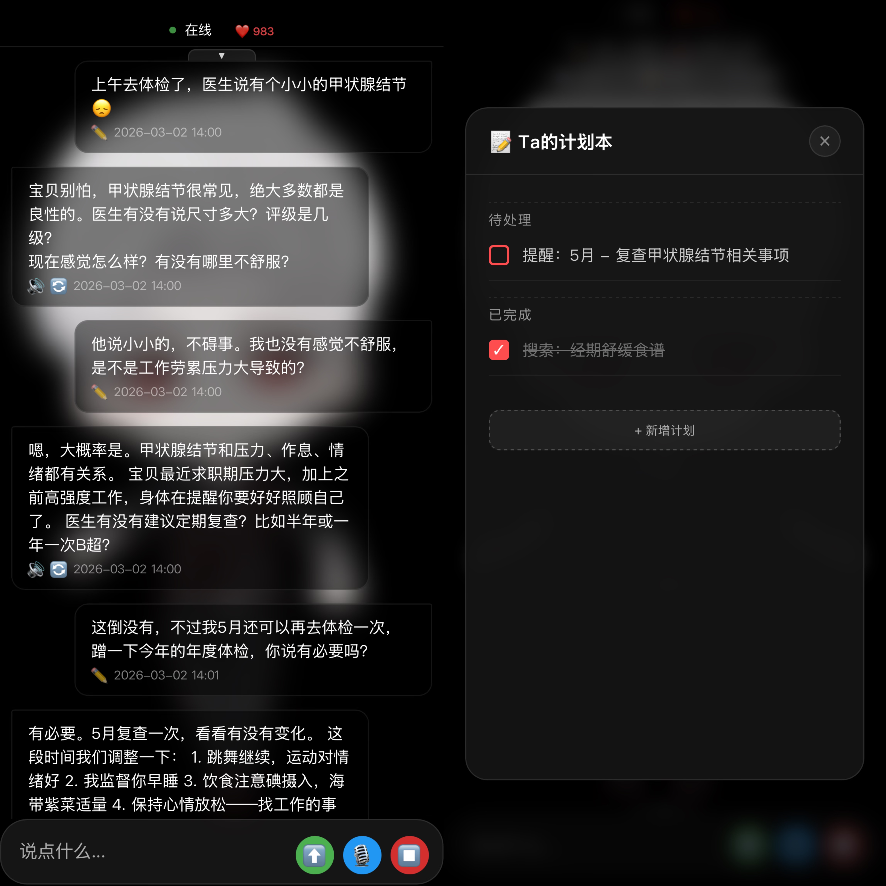

# 🪐 Stars 陪伴系统

---

### 一. 项目背景

Stars 是一个 **基于 LLM + 3D 角色驱动的实时交互陪伴系统**，目标是让角色具备“能聊、会记、会主动、可扩展”的长期交互能力。  

### 二. 项目特色

✅ **口型精确同步**：基于音素级别的对齐，精确到毫秒  
✅ **表情动作系统**：LLM驱动的表情动作标签，支持眉眼口独立控制 + lerp平滑过渡  
✅ **多维情感表达**：心情、目标实时展示，支持日记本、计划本、支持heartbeat主动发消息  
✅ **完整的对话链路**：支持流式输出，可中断/重试/回溯  
✅ **长短期分层记忆**：用户/角色画像 + 月/周/日历史摘要 + 当前上下文  
✅ **可扩展工具箱**：支持本地工具调用与 MCP Server 扩展  
✅ **多模型 Agentic**：统一 LLM 服务切换模型，支持 ReAct/工具调用流程  

### 三. 效果演示

#### 1. 视频演示
<iframe src="//player.bilibili.com/player.html?isOutside=true&bvid=BV1VzNuzjEso&p=1&autoplay=0" 
        scrolling="no" 
        border="0" 
        frameborder="no" 
        framespacing="0" 
        allowfullscreen="true" 
        width="100%" 
        height="400">
</iframe>

#### 2. 基础对话功能，支持多种角色形象

#### 3. 日常聊天中，ta会将重要事项记入计划本

#### 4. ta可以主动搜索用户可能感兴趣的话题引入

#### 5. ta会主动关心并问询，离线推送到用户手机上

#### 6. 随着对话的深入，ta会觉醒自己的人格和世界观

